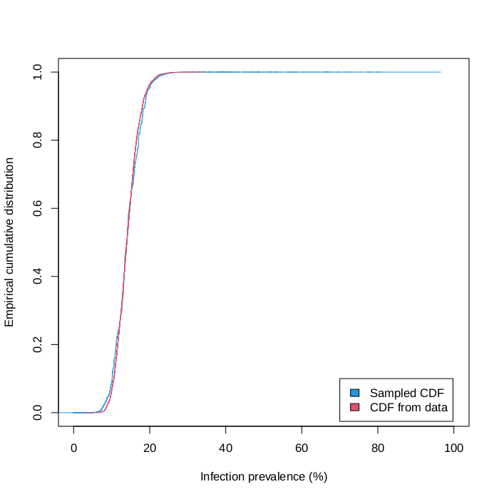

# Tests

# Running the tests

## Installing the NTD trachoma model

Navigate to the package top-level (the directory that contains `tests`), _e.g._
```shell
cd /path/to/trachomAMIS/
```
Create a python virtual environment and activate it:
```shell
python -m venv .venv
source .venv/bin/activate
```

Install the NTD trachoma model:

```shell
pip install ntd-trachoma
```

## Fixed seed regression test

Test `test_AMIS.R` runs two iteration of the AMIS algorithm with a
fixed seed. It then compares the resulting parameters and weights to
trusted data that we assume is correct (see Generating test data).

```R
R --no-save < test_AMIS.R
```
### Generating the test data

The fixed seed test `test_AMIS.R` reads in a geostatistical map in
`test_data/prevalence_map.csv`. This map can be re-generated using
`scripts/generate_test_map.csv`.

The expected results of the AMIS algorithm can be generated using
`scripts/AMIS_five_iterations_orig.R`. This script performs five
iterations of the AMIS algorithm and records the result of each
iteration is a separate file `test_data/param_iteration_?.csv` where
`?` is the iteration number.

## Empirical CDF based test

Script `test_ecdf.R` runs the AMIS algorithm for the NTD trachoma
model and compares the Empirical Cumulant Distribution Function (ECDF)
for both the weighted infection prevalence (sampled by through the
AMIS) and reference prevalence data (the reference geostatistical map).

Note that the AMIS is only run for a small subset of pixels.

### Usage
```shell
R --vanilla < test_ecdf.R [plot_dir]
```
If argument `plot_dir` is unspecified, plots are written in directory `tests/ecdf_plots`.

### Expected output


